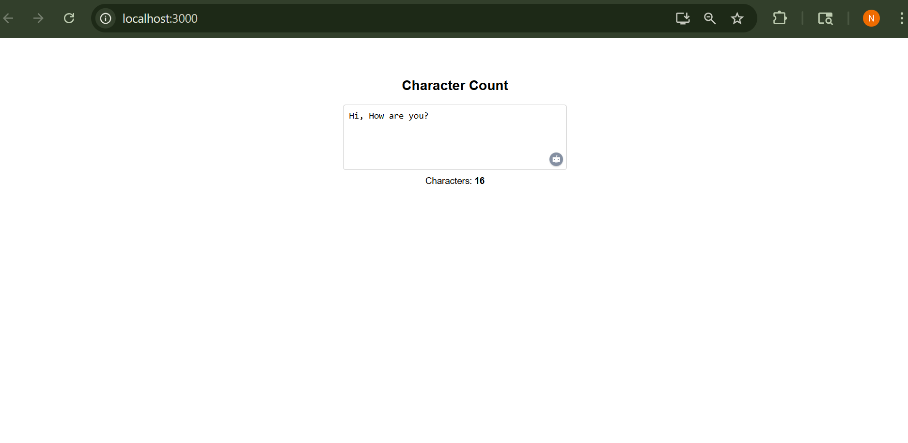

# Character Count App

A simple React application that allows users to type into a text area and displays the real-time count of characters. It's useful for writing tools, content editors, or learning purposes.

##  Features

- Live character counting

## Screenshot

>  Make sure you add your screenshot file named `screenshot.png` in the **root folder** of your project. You can also rename it or adjust 

